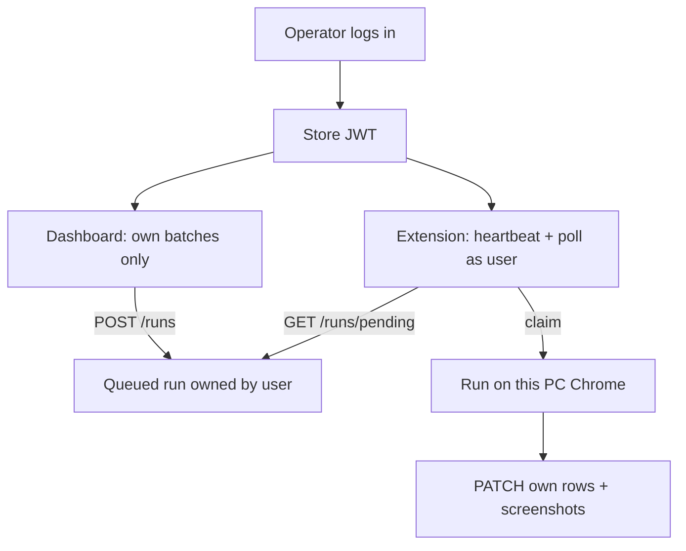
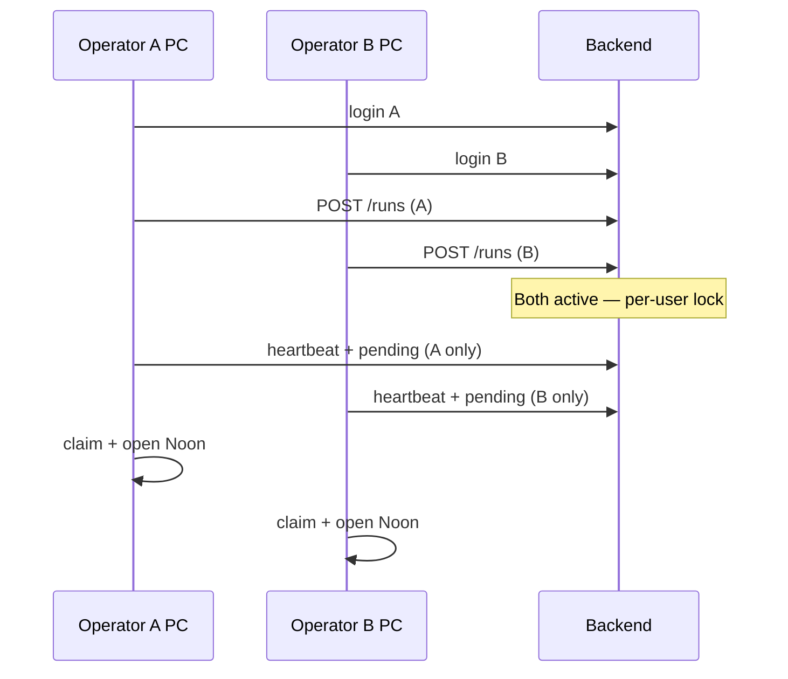

# Feature: Multi-user auth & tenant isolation

**Created**: 2026-09-03  
**Status**: Spec ready (Stage 1)  
**Directory**: `specs/002-multi-user-auth`

## Goal

Enable required login for dashboard and extension. Each operator (user) has isolated batches, runs, emails, screenshots, and extension presence. Multiple operators on different PCs can run automations at the same time without seeing or claiming each other’s work.

## Problem

Today `AUTH_REQUIRED` defaults to false. All PCs share one anonymous queue and one heartbeat. Any dashboard can start a job that any Chrome extension claims. Operators cannot safely work concurrently on the same live server.

## Actors

| Actor | Description |
|---|---|
| Operator | Logs in, uploads CSV, runs selected rows on their own Chrome extension |
| Admin | Same as any operator — just a seeded account name (`admin@example.com`). No special privileges. Add more users via `seeders/users.csv`. |
| Extension | Authenticated as the logged-in user (token from dashboard); heartbeats and claims only that user’s runs |

## User Scenarios & Testing

### US1 — Operator login (P1)

**As an** operator  
**I want to** sign in on the dashboard and extension  
**So that** only I can access my workspace

**Acceptance**
1. Unauthenticated API calls to batches/runs/emails return 401
2. Valid email/password returns access + refresh tokens
3. Invalid credentials return 401 with no token
4. Dashboard shows a login screen until authenticated
5. After dashboard login in the Chrome that has the extension, the extension receives the token automatically (no separate extension login form) and sends it on API calls

### US2 — Per-user data isolation (P1)

**As an** operator  
**I want** my batches, rows, runs, screenshots, and email history private  
**So that** other operators never see or mutate my data

**Acceptance**
1. Operator A’s `GET /batches` never returns Operator B’s batches
2. Operator A cannot fetch/patch/delete Operator B’s batch, row, run, or screenshot (404)
3. New uploads are owned by the authenticated user
4. Existing unowned rows (pre-migration) are assigned to the seeded admin account

### US3 — Multi-PC concurrent runs (P1)

**As** two operators on two PCs  
**I want** both to run batches at the same time  
**So that** we do not block each other

**Acceptance**
1. Operator A and Operator B can each have one active run simultaneously
2. Operator A’s extension never claims Operator B’s queued run
3. “Extension online” on A’s dashboard reflects only A’s extension heartbeat
4. Starting a second run for the **same** operator is rejected until the first stops/completes

### US4 — Seeded accounts (P2)

**As a** deployer  
**I want** known seed accounts  
**So that** operators can log in without an in-app user-admin UI

**Acceptance**
1. Seeded accounts exist on startup: `admin@example.com` / `admin123` and `user@example.com` / `password123`
2. Additional users are added by editing `seeders/users.csv` (no roles — every user is equal)
3. There is **no** admin-only create-user API in v1

### US5 — Dashboard-only login (P2)

**As an** operator  
**I want** to log in only on the dashboard  
**So that** I do not manage a second login in the extension

**Acceptance**
1. Dashboard persists session (token) and restores on reload
2. Expired/invalid token returns to login
3. Sign out clears dashboard token **and** clears the token copied into the extension
4. **No extension login UI** — popup does not ask for email/password
5. On successful dashboard login (same Chrome with extension installed), dashboard hands the access/refresh tokens to the extension via externally_connectable / content-script bridge
6. If the extension has no token, heartbeat/run APIs fail auth and dashboard shows extension offline / “open dashboard and sign in on this Chrome”
7. Extension attaches `Authorization: Bearer` from `chrome.storage.local` on all API calls

## Flow (Mermaid)

## Functional Requirements

- **FR-01**: Authentication is required for all batch, run, email, and screenshot mutating/list endpoints (health and login remain public).
- **FR-02**: Every batch, batch_run, and extension heartbeat is owned by a `user_id`.
- **FR-03**: All list/get/update/delete paths enforce ownership (or 404).
- **FR-04**: Active-run lock is **per user**, not global.
- **FR-05**: Pending-run poll and claim are scoped to the authenticated user.
- **FR-06**: Extension presence (`/runs/extension/status` + heartbeat) is per authenticated user.
- **FR-07**: Seed always ensures `admin@example.com` and `user@example.com` exist (equal users; no roles).
- **FR-08**: `AUTH_REQUIRED` defaults to `true`; documented in `.env.example`.
- **FR-09**: Dashboard login UI gates all controls until authenticated (only login surface).
- **FR-10**: Extension API client attaches `Authorization: Bearer <access_token>` from storage populated by the dashboard bridge — **no extension login form**.
- **FR-11**: Dashboard sign-in does **not** auto-push tokens. User must click **Connect extension** to onboard the extension in this Chrome; sign-out clears extension tokens.
- **FR-12**: Migration assigns null-owner historical data to the seeded `admin@example.com` account.
- **FR-13**: Screenshots remain reachable only when the caller owns the related row’s batch.

## Seed credentials (v1)

| Email | Password | Notes |
|---|---|---|
| `admin@example.com` | `admin123` | Seeded account (same powers as any user) |
| `user@example.com` | `password123` | Seeded account |

> Add more operators in `backend/seeders/users.csv`. No roles — each login gets its own private data.

## Out of Scope

- OAuth / SSO / password reset email
- In-app user admin / roles / permissions (v1 uses CSV seed only)
- Billing / quotas
- Removing the run poller in favor of same-tab messaging (can follow later)
- Per-device pairing within the same user account

## Assumptions

- One active automation run per user is enough; many users run in parallel.
- Operator uses **dashboard + extension in the same Chrome** after login (token bridge). Remote dashboard on a PC without the extension will not keep that user’s extension authenticated unless they also open/login the dashboard once on the extension PC.
- Same user remote-control across two PCs without logging in on the extension PC is **out of scope** for v1 (dashboard login on the machine that runs Chrome is required once).
- 404 (not 403) for cross-user resource access to avoid leaking IDs.
- SQLite remains fine for initial multi-user concurrency; claim uses status check + commit.
- Existing `EXTENSION_API_TOKEN` shared secret is secondary; JWT user auth is the primary gate.

## Edge Cases

- Two extensions logged in as the **same** user: first claim wins; second sees no pending / claim fails.
- Token expires mid-run: extension must refresh or fail with clear auth error; dashboard returns to login.
- Admin deletes/deactivates a user: inactive users cannot login; existing data retained but inaccessible to them.
- User with no extension online: create-run fails with “Extension is not loaded/online” for **that user**.

## Success Criteria

- Two operators can upload different CSVs and both show only their own lists.
- Two operators can start runs within the same minute; both complete without cross-claiming rows.
- Unauthenticated access cannot list any batches.
- New team member can be added via `users.csv` and log in after restart.
- Operators never observe another operator’s filenames, emails, or screenshots in the UI.

## Key Entities

- **User** — id, email, password hash, is_active (no roles)
- **Batch** — + user_id owner
- **BatchRun** — + user_id owner
- **ExtensionPresence** — per user_id last_seen
- **EmailSendHistory** — access via related batch ownership
