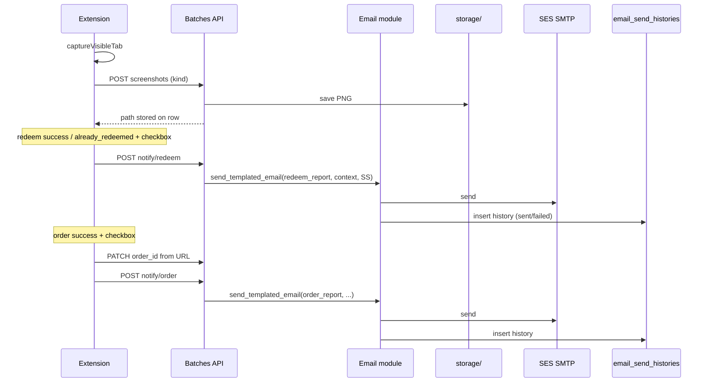

# Task: Screenshots, order_id fill, dedicated email module

## Goal
Capture redeem/order screenshots, store paths on the batch row, send separate redeem/order emails via a dedicated email management module (templated + history table), controlled by two extension checkboxes (default off).

## Requirements

### Extension
- Capture screenshots at: before redeem, after redeem, after order success
- Always save locally via backend (even if email disabled)
- Two checkboxes (default **off**, persist in `chrome.storage.local`):
  - Send redeem emails
  - Send order emails
- Pass checkbox flags into batch run
- On order success: parse order number from confirmation URL → patch `order_id`
- Redeem email trigger: `redeem_status` in (`success`, `already_redeemed`) and redeem-email checkbox on
- Order email trigger: `purchase_status === success` and order-email checkbox on
- No emails on failures / skip / payment_issue

### Backend — batch row columns
Reuse existing `order_id`. Add:
- `screenshot_before_redeem` (Text, nullable)
- `screenshot_after_redeem` (Text, nullable)
- `screenshot_after_order` (Text, nullable)

SQLite: ensure new columns exist on existing DBs (ALTER if missing).

### Backend — screenshots API
- `POST /batches/rows/{row_id}/screenshots`
  - multipart: `kind` = `before_redeem` | `after_redeem` | `after_order`, file = PNG
  - save under `storage/screenshots/{batch_id}/{row_number}/{kind}.png`
  - update matching row path column
  - return path + row

### Backend — dedicated **email** module
New module: `backend/app/modules/email/`

Structure:
```
email/
├── routes/routes.py
├── controllers/controller.py
├── services/
│   ├── send_email.py
│   ├── get_history.py
│   └── render_template.py
├── helpers/
│   ├── smtp_client.py
│   └── templates.py
├── models/
│   ├── db_models.py
│   ├── request_models.py
│   └── response_models.py
└── tests/
    └── test_email.py
```

**Templated send function** (callable from redeem/order flows):
```python
send_templated_email(
    db,
    template_key: str,          # e.g. "redeem_report" | "order_report"
    to_email: str,
    context: dict,              # custom params for template
    attachments: list[Path] | None = None,
    related_row_id: str | None = None,
    related_batch_id: str | None = None,
) -> EmailHistory
```

**Templates (in-code HTML/text):**
- `redeem_report` — status, balances, before/after SS attachments, timestamps
- `order_report` — order_id, product_url, email, purchased_at, order SS attachment

**SMTP settings** from `backend/.env` (`FAILOVER_MAIL_*` → map into Settings).

### Backend — email history table
New table `email_send_histories`:
| Column | Type | Notes |
|---|---|---|
| id | UUID PK | |
| template_key | str | |
| to_email | str | |
| from_email | str | |
| from_name | str | |
| subject | str | |
| body_text | text | |
| body_html | text \| null | |
| status | str | `sent` / `failed` |
| error | text \| null | |
| attachment_paths | text \| null | JSON list of paths |
| context_json | text \| null | JSON of custom params |
| related_row_id | str \| null | FK soft / indexed |
| related_batch_id | str \| null | |
| created_at | datetime | |

Always insert a history row (success or fail) after each send attempt.

Optional read API:
- `GET /emails/history?row_id=&limit=` — list history

### Trigger APIs (batch → email module)
- `POST /batches/rows/{row_id}/notify/redeem` — load row + SS paths, call `send_templated_email("redeem_report", ...)`
- `POST /batches/rows/{row_id}/notify/order` — load row + order SS, call `send_templated_email("order_report", ...)`

Extension calls these only when the matching checkbox is enabled.

## Flow (Mermaid)



## Acceptance Criteria
- [ ] Email module exists with templated `send_templated_email(...)` and custom context params
- [ ] Every send attempt writes a full row to `email_send_histories`
- [ ] Screenshot paths stored on batch row; files on disk
- [ ] Redeem email only on success/already_redeemed when checkbox on
- [ ] Order email only on order success when checkbox on; includes order_id + product URL + SS
- [ ] Checkboxes default off and persist
- [ ] Failures never trigger notify
- [ ] Tests for template render + history create + notify gates

## Files to Change
- `backend/app/modules/email/**` (new)
- `backend/app/config/settings.py` — SMTP settings
- `backend/app/config/database.py` — register models + column migrate
- `backend/app/app.py` — include email router
- `backend/app/modules/batches/models/*` — SS path columns + notify routes
- `backend/app/modules/batches/tests/*`
- `backend/pyproject.toml` — no new dep if stdlib smtp; use `email.message` + `smtplib`
- `noon-extension/public/*` — capture + notify hooks
- `noon-extension/src/features/batches/BatchesPanel.tsx` — 2 checkboxes
- `noon-extension/src/types.ts` / `batchRunner.js` / `batchApi.js`
