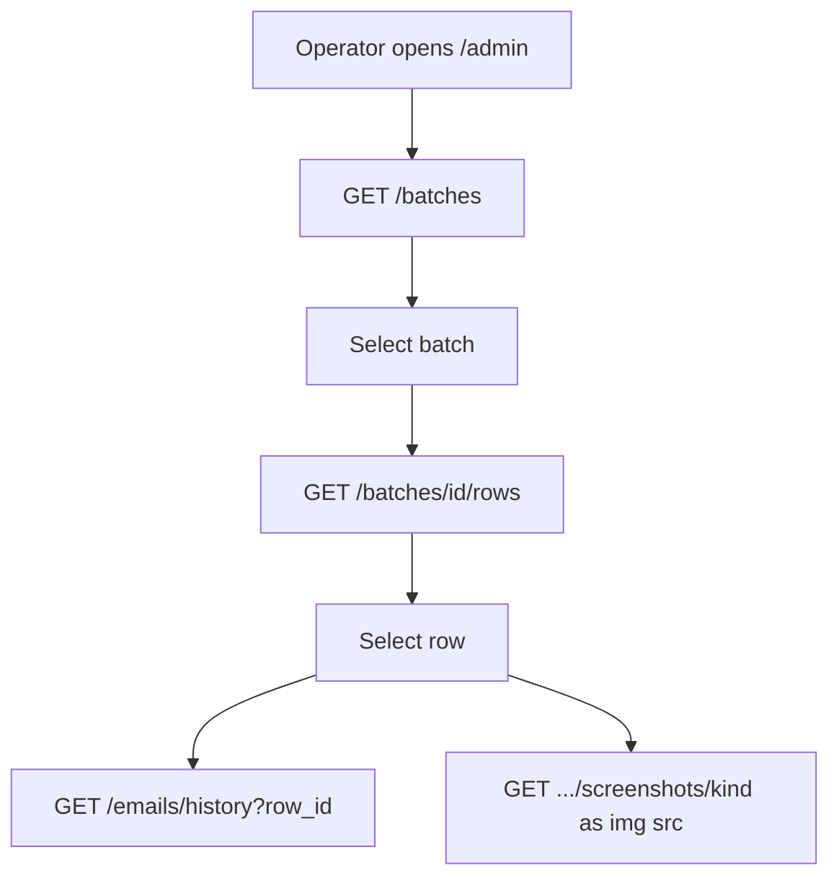

# Task: View-only admin dashboard (FastAPI)

## Goal

Serve a read-only ops dashboard on the FastAPI port (`/admin`) that matches the Chrome extension visual language (dark slate + noon yellow). Show batch/row status, email send history, and screenshots. No run/reset/retry actions.

## Requirements

1. **Host on FastAPI port** — `GET /admin` (and static assets under `/admin/…`) served from the same app as `/batches`.
2. **Screenshot GET endpoint** — `GET /batches/rows/{row_id}/screenshots/{kind}` where `kind` is `before_redeem` | `after_redeem` | `after_order`. Returns the PNG from disk (404 if missing). Auth via existing `require_auth`.
3. **Dashboard UI (read-only)**
   - Batches list with filename, status, counts (pending / in_progress / completed / partial / failed), timestamps
   - Click batch → rows table with stage statuses (login / redeem / order) + overall status
   - Status filter on rows (all / pending / failed / partial / completed / in_progress)
   - Row detail panel: credentials + product, stage errors/timestamps, balances, order_id
   - Screenshots as `` via the new GET endpoint (show placeholder when absent)
   - Email history for selected row via existing `GET /emails/history?row_id=`
   - Auto-refresh batches list every ~5s while page open
4. **Visual design** — reuse extension palette only:
   - `bg` `#0f172a`, `surface` `#1e293b`, `border` `#334155`, `noon` `#feee00`
   - Slate text hierarchy; yellow accent for brand + primary links
   - Dense ops tables (like extension Batches tab), not marketing/card grids
   - No purple gradients, no glassmorphism, no emoji chrome, no generic “AI dashboard” look
5. **Out of scope** — upload, delete, reset-to-pending, start run, trigger extension, auth login page

## Flow (Mermaid)

## Acceptance Criteria

- [ ] Opening `http://127.0.0.1:8000/admin` shows the dashboard
- [ ] Batches and rows reflect live API status (read-only)
- [ ] Row detail shows email history when records exist
- [ ] Screenshot images load via GET endpoint when files exist; graceful empty state otherwise
- [ ] UI uses extension colors; no mutation/action buttons beyond navigation/filter/refresh
- [ ] Unit/API tests cover screenshot GET (200 + 404)

## Files to Change

- `backend/app/app.py` — mount static admin + `/admin` route
- `backend/app/static/admin/` — `index.html`, `styles.css`, `app.js`
- `backend/app/modules/batches/` — screenshot GET service + route
- `backend/app/modules/batches/tests/` — screenshot GET tests
- `docs/context/backend.progress.md` / `frontend.progress.md` — progress notes
