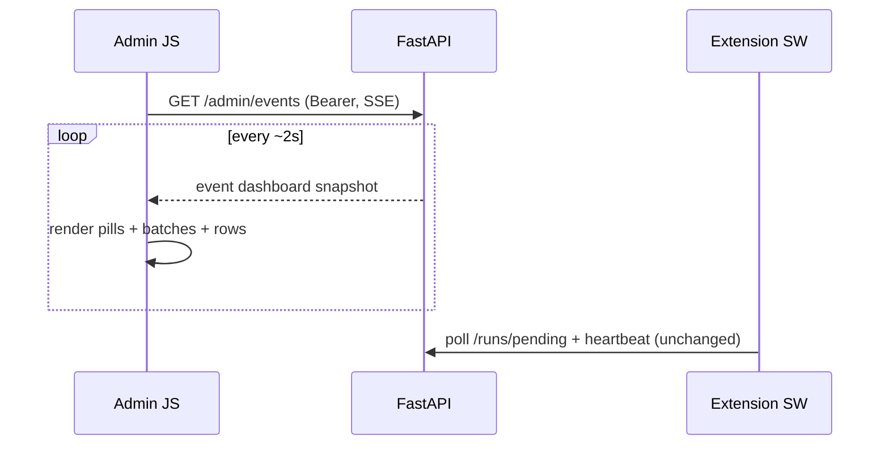

# Task: Admin dashboard live updates via SSE

## Goal

Replace the admin dashboard’s timed GET polling with one authenticated SSE stream so the UI stays live without `/health` + `/runs/extension/status` + `/batches` + `/runs/active` on an interval. Extension run poller stays on HTTP poll/alarms (MV3).

## Requirements

1. **SSE endpoint** — `GET /admin/events` (or `/runs/events`) returns `text/event-stream`.
   - Auth: same JWT as dashboard (`Authorization: Bearer …`). Because browser `EventSource` cannot set headers, client uses **fetch + ReadableStream** (not raw `EventSource`), reusing `AdminAuth.getAccessToken()`.
   - Scoped to the authenticated user (same tenancy as batches/runs/presence).
   - Headers: `Cache-Control: no-store`, `X-Accel-Buffering: no` (proxy-friendly).
2. **Event payload** — periodic snapshot (every ~2s) as one `dashboard` event JSON:
   - `health`: `"ok"` | `"error"`
   - `extension`: `{ online, last_seen_at, ttl_seconds }`
   - `active_run`: run object or `null`
   - `batches`: list matching `GET /batches?limit=100` shape
   - `rows`: optional; when client sends `batch_id` query (or reconnects with it), include that batch’s rows (`limit=500`, no status filter — client keeps local filter) **or** omit rows and let client keep one-shot `loadRows` on selection only (prefer include rows for selected batch to kill silent poll).
3. **Client**
   - Remove `setInterval` pollers in `app.js` (5s) and `controls.js` (2.5s active/extension).
   - On login / auth-ready: open SSE; on logout / 401: close stream.
   - On each `dashboard` event: update health pill, extension pill, active run, batches; if selected batch matches, update rows + detail (preserve selection / checkboxes like silent `loadBatches` today).
   - Keep manual **Refresh** as one-shot REST reload + reconnect if stream dead.
   - Auto-reconnect with backoff when stream drops (while authenticated).
4. **Out of scope**
   - Extension `runPoller.js` / heartbeat / claim loop
   - WebSocket
   - True DB change pub/sub (snapshot-over-SSE is enough)
5. **Tests** — API test: authenticated SSE returns at least one `dashboard` event with expected keys; 401 without token when `AUTH_REQUIRED`.

## Flow (Mermaid)

## Acceptance Criteria

- [ ] With dashboard open and logged in, no recurring GET poll for health/extension/batches/active (only SSE + intentional REST: upload/run/stop/delete/detail emails/screenshots/manual refresh)
- [ ] Extension online + active run + batch/row status still update live during a run
- [ ] Login opens stream; sign-out closes it; 401 closes + shows login
- [ ] Unauthenticated SSE request → 401 when auth required
- [ ] Extension polling behavior unchanged

## Files to Change

- `backend/app/modules/batches/` — SSE route + snapshot service (reuse get_batches / get_active_run / presence)
- `backend/app/static/admin/app.js` — drop 5s interval; consume SSE
- `backend/app/static/admin/controls.js` — drop 2.5s intervals; rely on SSE for active/extension
- `backend/app/static/admin/util.js` — optional small SSE helper
- `backend/app/static/admin/index.html` — cache-bust asset query
- `backend/app/modules/batches/tests/` — SSE auth + event smoke test
- `docs/context/backend.progress.md` — progress note
