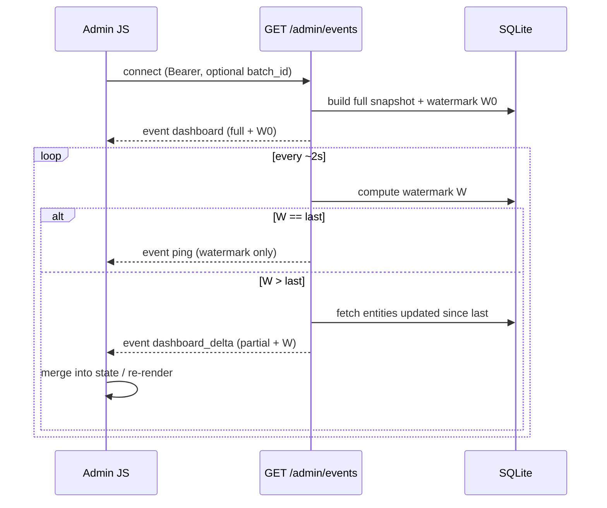

# Task: SSE delta events + watermark (no full-JSON loop)

## Goal

Stop `/admin/events` from re-serializing the full dashboard every 2s. On connect (and batch switch), send **one** full snapshot; afterward send **only changed pieces** when a watermark advances; when idle send a tiny keep-alive (or nothing material).

## Requirements

1. **Watermark** — per connection, track a server-computed watermark = max of relevant `updated_at` / `last_seen_at` for this user (batches, selected-batch rows if any, active/queued run, extension presence). Cheap `MAX(...)` queries — not a full list dump.
2. **Bootstrap snapshot** — first event (and after `batch_id` changes / reconnect): `event: dashboard` with today’s full shape (`health`, `extension`, `active_run`, `batches`, `rows` for selected batch) **plus** `watermark` (ISO UTC string).
3. **Delta loop (~2s)**  
   - Recompute watermark.  
   - If unchanged → `event: ping` with `{"watermark":"..."}` (keep-alive for proxies; **no** batches/rows payload).  
   - If advanced → `event: dashboard_delta` containing **only** what changed since the previous watermark, e.g.:
     - `watermark` (new)
     - `extension` if presence changed
     - `active_run` if run changed (or `null` if cleared)
     - `batches`: only batch summaries with `updated_at`/`created_at` > previous watermark (and `batches_total` when total changes)
     - `rows`: `{ batch_id, rows: [...] }` only for selected batch rows with `updated_at` > previous watermark  
   - Do **not** resend the entire batch/row list on every tick.
4. **Client** (`sse.js` + `snapshot.js`)  
   - `dashboard` → replace state (existing `applyDashboardSnapshot`).  
   - `dashboard_delta` → merge by id (upsert batches/rows; apply extension/active_run; ignore unknown fields).  
   - `ping` → no UI rewrite.  
   - Preserve selection / checkboxes behavior as today.
5. **Secrets on the wire (live stream)** — omit `password` and `gift_card_pin` from SSE snapshot/delta row payloads. Row detail that needs secrets continues to use REST (`loadRows` / detail fetch) on click — table live updates do not need PINs.
6. **Out of scope** — WebSocket, Redis pub/sub, emit-on-write bus, extension run poller, dropping secrets from REST `GET /batches/.../rows`.
7. **Tests** — auth still 401; first event is full `dashboard` with watermark; after a no-op tick with `max_events`/test harness, idle path does not repeat full `batches` array (ping or delta without full list); optional: after mutating a row, delta includes that row only.

## Flow (Mermaid)

## Acceptance Criteria

- [ ] First event after connect is a full `dashboard` snapshot including `watermark`
- [ ] When nothing changes, stream does **not** resend full batches/rows JSON (ping or empty-ish keep-alive only)
- [ ] When a row/batch/run/presence updates, UI reflects it via `dashboard_delta` without requiring a full list replace
- [ ] Switching selected `batch_id` rebases with a full snapshot for that batch (or equivalent correct row set)
- [ ] SSE row payloads do not include `password` or `gift_card_pin`
- [ ] Unauthenticated → 401; extension HTTP poller unchanged
- [ ] Existing dashboard live feel preserved (health, extension, active run, batch/row status)

## Files to Change

- `backend/app/modules/batches/services/dashboard_events.py` — watermark + delta builders; redact secrets for SSE
- `backend/app/modules/batches/routes/admin_events.py` — snapshot once, then watermark/delta/ping loop
- `backend/app/modules/batches/services/get_batches.py` / `get_batch_rows.py` — optional `updated_since` filters (or queries live in `dashboard_events.py`)
- `backend/app/static/admin/sse.js` — dispatch `dashboard` / `dashboard_delta` / `ping`
- `backend/app/static/admin/snapshot.js` — `applyDashboardDelta` merge
- `backend/app/static/admin/index.html` — cache-bust query on touched assets
- `backend/app/modules/batches/tests/test_dashboard_events.py` — watermark / ping / delta coverage
- `docs/context/conventions.md` — Admin live updates note
- `docs/context/backend.progress.md` — progress line
