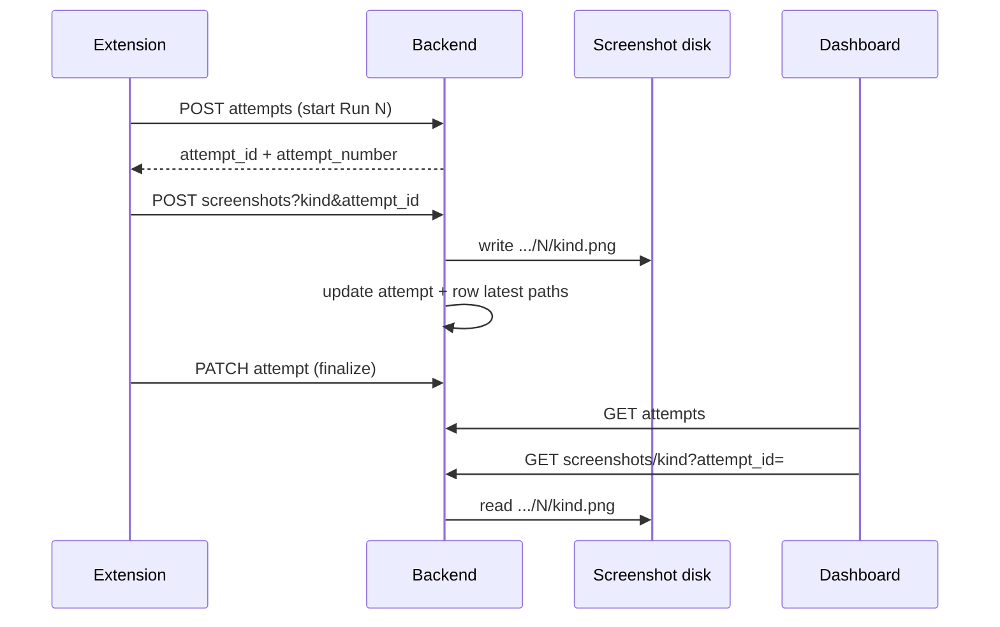

# Task: Per-attempt screenshots

## Goal

Store redeem/order/failure screenshots **per row attempt** (Run #1, Run #2, …) so selecting a run in the dashboard shows that run’s images — not the latest overwrite on the row.

## Requirements

1. Add screenshot path columns on `batch_row_attempts`:
   - `screenshot_before_redeem`, `screenshot_after_redeem`, `screenshot_after_order`, `screenshot_on_failure`
2. Save files under `{batch_id}/{row_number}/{attempt_number}/{kind}.png` (no overwrite across runs).
3. `POST /batches/rows/{row_id}/screenshots?kind=&attempt_id=` attaches the shot to that attempt; also mirror paths onto `batch_rows` (latest) for email attachments / backward compat.
4. `GET /batches/rows/{row_id}/screenshots/{kind}?attempt_id=` serves that attempt’s image; without `attempt_id`, serve row “latest” as today.
5. Extension: pass `activeAttemptId` on every screenshot upload (attempt already started via `beginRowAttempt`).
6. Dashboard: when a run is selected, show that attempt’s screenshot URLs (with `attempt_id`); “No screenshot” if that run never captured one.
7. Include screenshot paths on `RowAttemptResponse` so the detail UI can bind without extra fetches when possible.
8. SQLite column ensure + tests for upload/get scoped by attempt.

## Flow (Mermaid)

## Acceptance Criteria

- [ ] Run #1 and Run #2 of the same row keep separate screenshot files.
- [ ] Selecting Run #1 in the UI shows Run #1 shots (or “No screenshot”), not Run #2’s.
- [ ] Selecting Run #2 shows Run #2 shots.
- [ ] Email notify still uses row-level latest paths.
- [ ] Existing rows without `attempt_id` still serve latest row screenshots.
- [ ] Tests cover per-attempt upload + get.

## Files to Change

- `backend/app/modules/batches/models/db_models.py`
- `backend/app/modules/batches/models/response_models.py`
- `backend/app/config/database.py` (sqlite ensure columns on `batch_row_attempts`)
- `backend/app/modules/batches/services/save_screenshot.py`
- `backend/app/modules/batches/services/get_screenshot.py`
- `backend/app/modules/batches/services/row_attempts.py`
- `backend/app/modules/batches/routes/routes.py`
- `backend/app/modules/batches/controllers/controller.py`
- `backend/app/modules/batches/tests/` (new or extend)
- `noon-extension/public/batchApi.js`
- `backend/app/static/admin/util.js` (+ cache-bust `index.html`)
