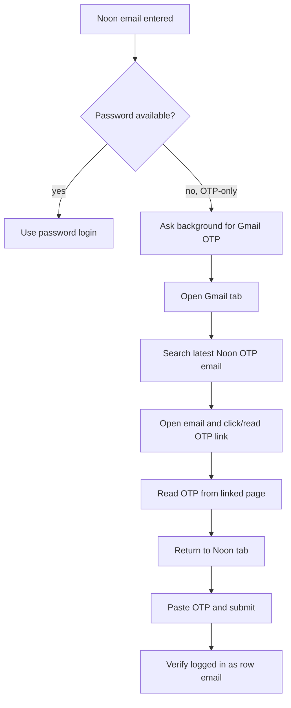

# Task: Gmail OTP Login Flow

## Goal
When Noon shows an OTP-only login screen, the extension should open Gmail, find the latest Noon OTP email, follow the email's "click here" link, read the OTP from the linked page, return to Noon, paste the OTP, and complete login.

## Requirements
- Keep password login as the first preference when available.
- Trigger Gmail OTP only when Noon is OTP-only and no password switch/input is available.
- Open or reuse a Gmail tab without losing the active Noon tab.
- Search Gmail for recent Noon OTP/login email, open the newest matching message, and find the "click here" link.
- Open the link in the Gmail tab, read a 4-8 digit OTP from the destination page, then return focus to Noon.
- Paste OTP into Noon OTP inputs using existing React-safe typing helpers.
- Submit OTP and verify login via existing profile/session checks.
- Fail with a clear message if Gmail is not signed in, no Noon email is found, no OTP link is found, or no OTP can be read.
- Do not remove existing cancellation behavior.

## Flow

## Acceptance Criteria
- OTP-only Noon screen no longer immediately throws manual-login error.
- Gmail tab automation returns an OTP code or a specific actionable error.
- Noon OTP fields are filled and submitted.
- Existing password-login flow remains unchanged.
- Extension build passes.

## Files to Change
- `noon-extension/public/manifest.json`
- `noon-extension/public/background.js`
- `noon-extension/public/messageRouter.js`
- `noon-extension/public/content/02-dom-query.js`
- `noon-extension/public/content/03a-login-password.js`
- `noon-extension/public/content/09-login-steps.js`
- `noon-extension/public/content/11-session.js`
- new `noon-extension/public/gmailOtp.js`
