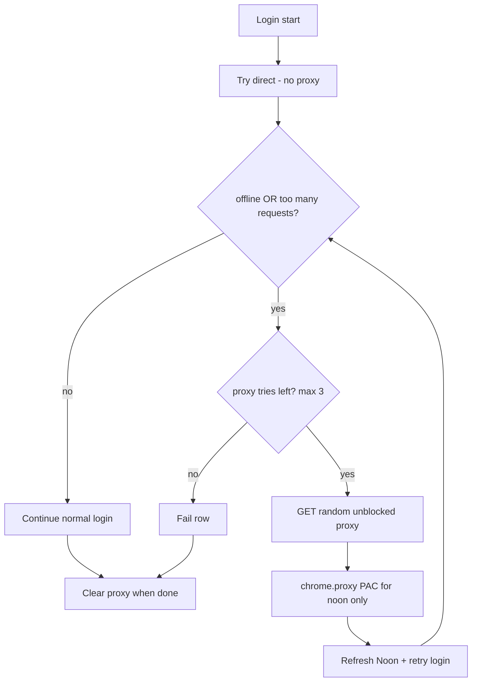

# Task: Rotate proxy on offline / too many requests

## Goal
When Noon login hits **Looks like you're offline** or **Too many requests**, switch to a **random proxy** from the pool and retry login — up to **3** proxy attempts. No account↔proxy sticky binding.

## Requirements
- **First attempt:** no proxy (direct IP) — current behavior.
- On detecting either error during login (email continue, password, or OTP submit):
  1. Ask backend for a **random unblocked** proxy.
  2. Apply it in Chrome via `chrome.proxy` (PAC: only `noon.com` / `account.noon.com` → proxy; dashboard/Gmail/API → DIRECT).
  3. Hard-refresh / reopen Noon login and **retry the same row login**.
  4. Repeat with a **new random** proxy up to **3** times total (after the direct attempt).
- If a proxy fails health/login → mark it blocked so it is not reused soon.
- After success or final failure → clear Chrome proxy (back to direct).
- Do **not** bind proxy to email/account.
- Proxy source: project `proxies.csv` (`id`, `proxy`, `type`, `is_blocked`, …) loaded by backend.
- Skip rows with `is_blocked=1`; prefer live random among `is_blocked=0`.
- Clear, logged steps: `Proxy rotate 1/3 → host:port`, etc.
- Max 3 proxy retries; then fail the row with a clear error (do not infinite loop).

## Flow

## Acceptance Criteria
- Direct-first login unchanged when no rate-limit/offline error.
- Offline / too many requests triggers proxy rotate + login retry (≤3).
- Proxies are random from unblocked list; no sticky email mapping.
- Failed proxies can be marked blocked via API.
- Chrome proxy cleared after row finishes (success or fail).
- Extension build + backend proxy unit tests pass.

## Files to Change
- `backend/app/modules/proxies/` (new module: load CSV, next, mark blocked)
- `backend/app/app.py` (wire router)
- `proxies.csv` (source; ensure gitignore if secrets later — currently public list)
- `noon-extension/public/manifest.json` (`proxy` permission)
- `noon-extension/public/messageRouter.js` / new `proxyTab.js` (or similar)
- `noon-extension/public/content/01-core.js` / `02-dom-query.js` (detect “too many requests”)
- `noon-extension/public/content/09-login-steps.js` / `11-session.js` (retry loop)
- `noon-extension/public/batchRunner.js` (ensure proxy cleared after row)
- `backend/tests/test_proxies.py`
